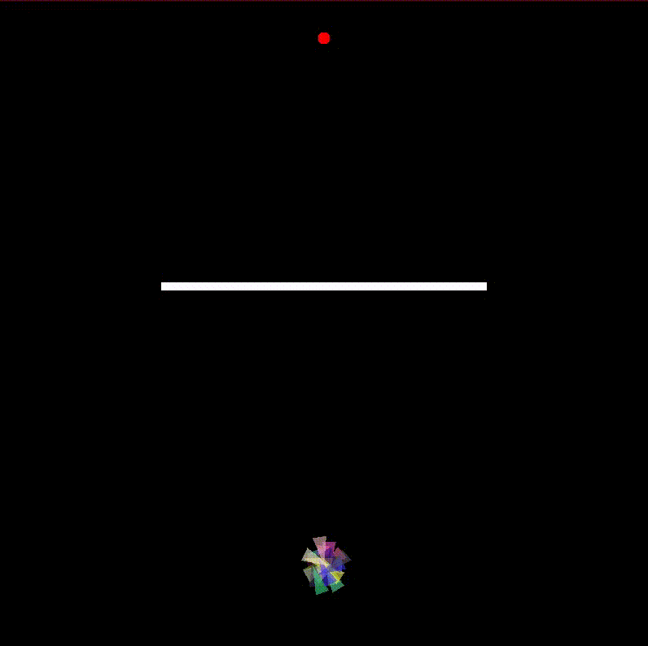
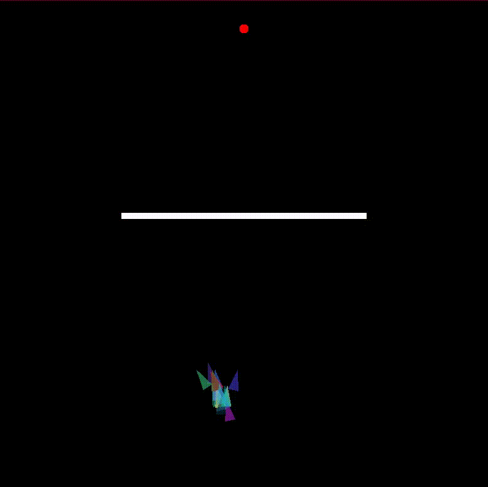
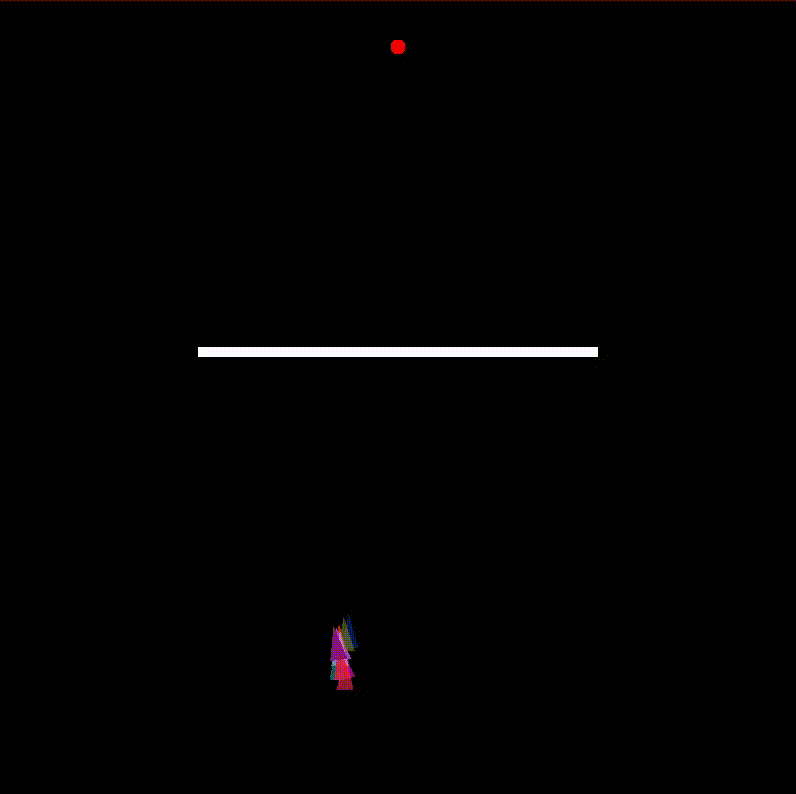

# Introduction
This is a simple, yet a powerful implementation of Genetic Algorithm, that literally uses "Survival of Fittest" to optimally reach a target.

In this case, we start with a bunch of rockets who have no idea what's going on.

In further generations, we can see them trying to seek a particular target, even when obstacles are placed.

After enough generations, they behave ideally/optimally and sucessfully reach the target.

# Generation 1
Well, this is just an absolute mess !

# Generation 4
Okay, Baby steps.

# Generation 10
Oh it figured it out !

# Resources
 
 https://en.wikipedia.org/wiki/Genetic_algorithm
 https://natureofcode.com/book/chapter-9-the-evolution-of-code/
 https://www.youtube.com/watch?v=RxTfc4JLYKs
